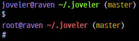

# Joveler's dotfiles

The repo contains my personal dotfiles.

## Prerequisite

Install required programs and frameworks: 

```console
sudo apt update
sudo apt install git vim zsh tmux screen wget curl universal-ctags
chsh -s $(which zsh)
```

## Install

Clone this repo and run `install.sh`:

```console
git clone https://github.com/ied206/dotfiles.git ~/.joveler
~/.joveler/install.sh
```

The install script does not setup `.bashrc` by default. To overwrite it, pass `bash` argument:

```console
~/.joveler/install.sh bash
```

## Update

You may update the dotfiles with `update.sh`:

```console
~/.joveler/update.sh
```

## Support

- tmux
- screen
- vim
- zsh
    - zprezto
    - custom prompt<br>
    
- bash

## License

Licensed under the MIT license.

